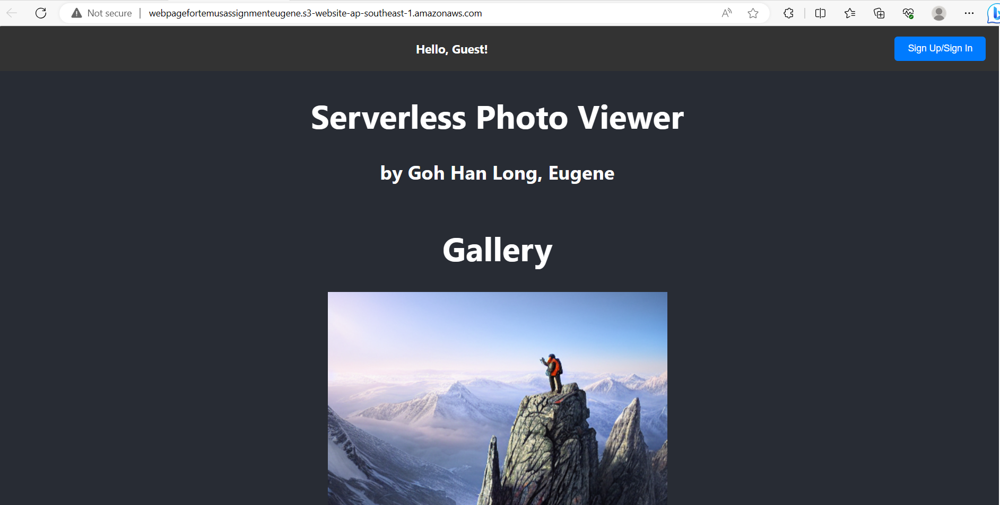

# AWS-Assignment
Techncial Interview for Temus

This project showcases a simple serverless web application for an administrator to upload and share photos. The webpage allows for the administrator to upload photos directly from his/her computer to an S3 bucket and to modify the visibility setting of the photo. Access restriction is taken into consideration where some photos can be visible to the public (as a guest role). To view all the photos, the guest needs to create an account and sign in via Amazon Cognito Hosted UI. Users are able to see all photos uploaded by the administrator. Only the administrator can modify the visibility setting of the photo.

All guests will first arrive at the landing page where they will only be able to see photos that are marked as "Public". There is a "Sign In/Sign Up" button at the top header for guests to sign in. This service is handled by AWS Cognito Hosted UI. Once signed in and authenticated, the guests will be redirected to the home page, where they can view all photos. For administrators, they will be able to see the 'File Upload' button and after clicking on the image, they will also be able to change the visibility of the photo.

Photo Upload and Access Restrictions: Administrators should have the ability to upload photos to the application and set visibility. Photos marked for public viewing should be accessible to anyone, while private photos should only be viewable by signed-in users. 

User Signup and Management: AWS Cognito is used to manage the users who have signed in. Two user pools groups are created in AWS Cognito - admins. Currently, only the AWS Console administrator can set himself as the admin. 

Preferred Technology Stack: The chosen technology stack aligns with the recommended serverless architecture. It uses React for the front end - which is a static website hosted on Amazon S3. Amazon Cognito is used for authentication, while the backend is implemented in Node.js using AWS Lambda. The front end interacts with the back end through API Gateway. DynamoDB serves as the database, and Amazon S3 is used for storage for website hosting and the photos. This stack ensures cost-effectiveness, scalability, and compatibility with the AWS Free Tier.

